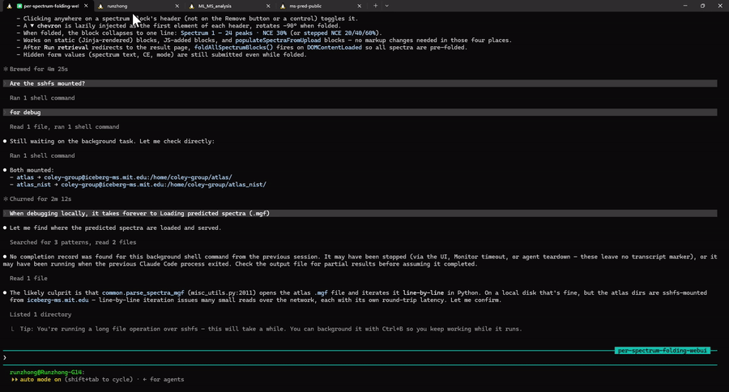

# Restore Agent Sessions

Restore your Codex and Claude Code sessions in WSL+Windows Terminal, so that you won't lose your progress if your PC reboots.

## Demo



## Install

```bash
curl -fsSL https://raw.githubusercontent.com/rogerwwww/Restore-agent-sessions/main/install.sh | bash
```

## Use

```bash
agent-live-sessions
agent-restore-sessions
```

Session snapshots are stored in `~/.agent_sessions/`.
